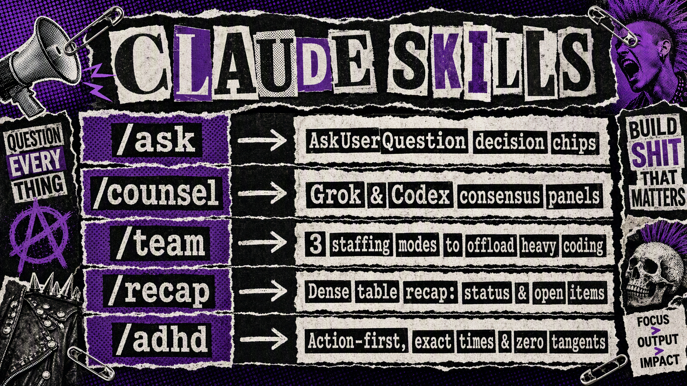
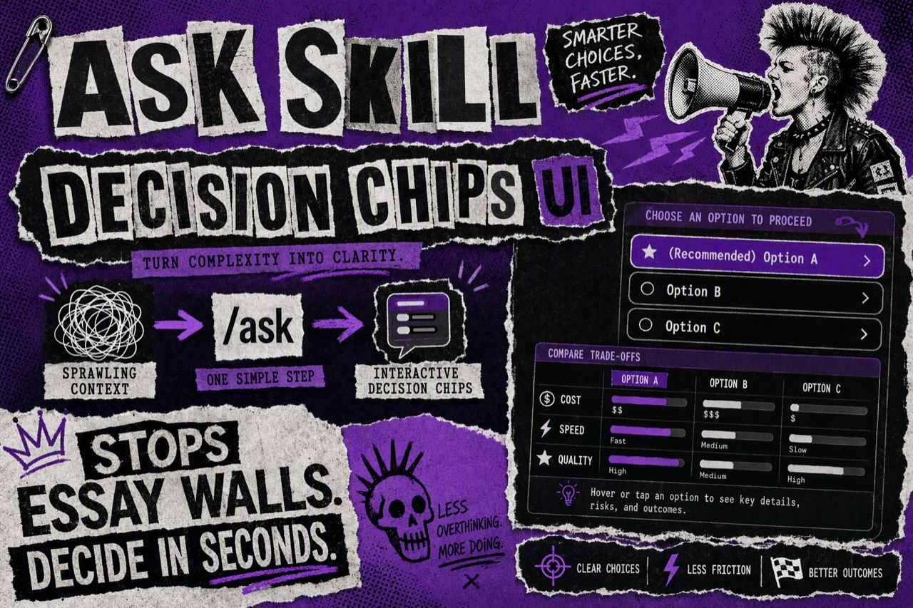
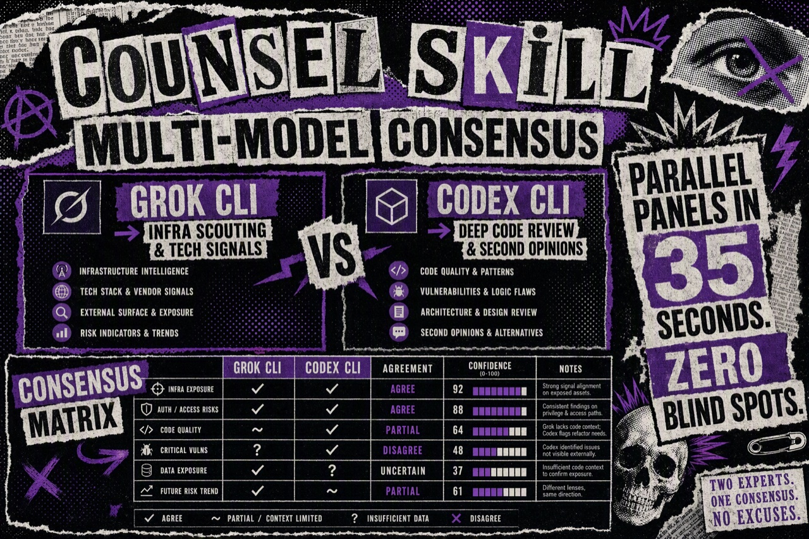
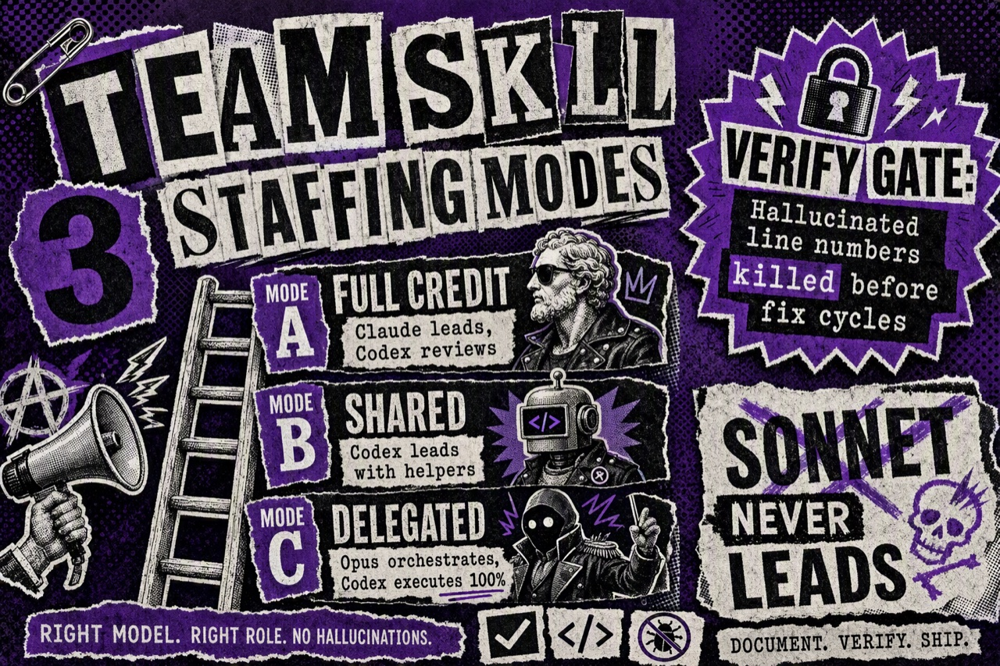
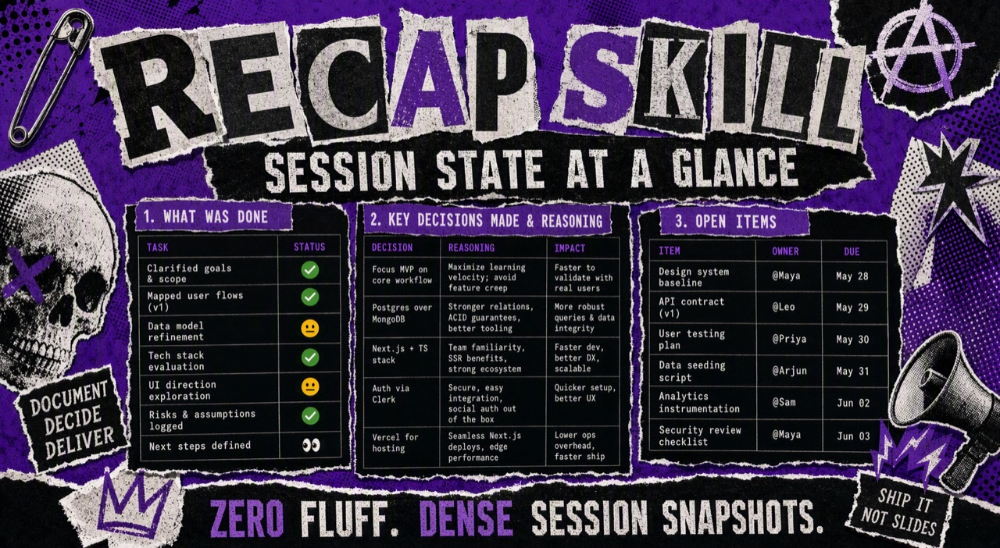
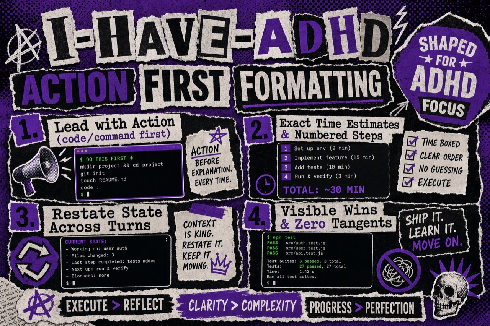

# 🛠️ claude-skills

[](https://opensource.org/licenses/MIT)
[](https://github.com/ArchieeR/claude-skills)
[](https://github.com/ArchieeR/claude-skills)

<p align="center">
  
</p>

A curated collection of 5 core production-grade [Agent Skills](https://docs.claude.com/en/docs/claude-code/skills) for **Claude Code**, **Goose**, and **Berd**.

Designed for **context engineering & multi-agent orchestration** — fanning out multi-model panels, offloading heavy coding to worker agents, managing decision UI, and keeping human judgment at high leverage.

---

## 🚀 Quick Install

### Option A: 1-Command Install via `npx` / `skillfish` (Recommended)

Run a single command without cloning:

```bash
npx skillfish add ArchieeR/claude-skills --all
```

To install a specific skill (e.g., `ask` or `team`):

```bash
npx skillfish add ArchieeR/claude-skills ask
```

---

### Option B: Clone & Symlink / Copy

Clone the repository and copy or symlink into your global `~/.claude/skills/` directory:

```bash
git clone https://github.com/ArchieeR/claude-skills.git ~/claude-skills
mkdir -p ~/.claude/skills

# Copy all 5 core skills
cp -R ~/claude-skills/skills/* ~/.claude/skills/

# OR symlink individual skills so `git pull` keeps them fresh:
ln -s ~/claude-skills/skills/ask ~/.claude/skills/ask
```

---

## 🧰 The 5 Core Skills

| Skill | Trigger / Command | Description |
| :--- | :--- | :--- |
| **[`ask`](skills/ask)** | `/ask` | Converts fat text and sprawling sub-agent reports into interactive `AskUserQuestion` decision chips so you can steer in seconds. |
| **[`counsel`](skills/counsel)** | `/counsel <question>` | Fires parallel consensus panels across **Grok CLI** (infra scouting) and **Codex CLI** (code review) to eliminate blind spots. |
| **[`team`](skills/team)** | `/team [a\|b\|c] <task>` | Multi-model implement → verify → fix → commit loop with 3 staffing modes to offload heavy investigation, writing, and fixing to Codex workers. |
| **[`recap`](skills/recap)** | `/recap`, `/table` | Dense table-format recap of the current session: work done, status, decisions made, and open follow-up items. |
| **[`adhd`](skills/adhd)** | `/adhd` | Shapes model output specifically for ADHD focus: leads with immediate action, numbers multi-step work, suppresses tangents, and gives exact time estimates. |

---

## 🖼️ Visual Guides

### 1. [`/ask`](skills/ask) — Decision UI & Choice Chips
Converts sprawling context and fat sub-agent reports into clean `AskUserQuestion` decision chips with explicit trade-offs.

<p align="center">
  
</p>

---

### 2. [`/counsel`](skills/counsel) — Multi-Model Consensus Panels
Fires parallel panels across **Grok CLI** (for infrastructure scouting) and **Codex CLI** (for code review) to eliminate blind spots in ~35 seconds.

<p align="center">
  
</p>

---

### 3. [`/team`](skills/team) — Multi-Model Execution & Offloading
Offloads heavy investigation, writing, and fixing to Codex worker agents across 3 staffing modes (A, B, C) while enforcing strict verification gates (*"Sonnet never leads"*).

<p align="center">
  
</p>

---

### 4. [`/recap`](skills/recap) — Session State at a Glance
Dense, 3-table snapshot of the session: status of work done, decisions locked, and open follow-up items.

<p align="center">
  
</p>

---

### 5. [`/adhd`](skills/adhd) — Action-First Output Shaping
Shapes model output specifically for ADHD focus: leads with code/commands first, provides exact time estimates, numbers multi-step work, and eliminates prose fluff.

<p align="center">
  
</p>

---

## 🎯 Key Design Principles

1. **Model Agnostic & Multi-CLI**: Skills referencing external CLIs (`codex`, `agy`, `grok`) degrade gracefully if those binaries aren't installed or authed.
2. **Context Efficiency**: Heavy transcript reading and deep searches are offloaded to background sub-agents so your primary conversation context stays lightweight and sharp.
3. **Scrubbed & Portable**: All skills are scrubbed of machine-specific paths, private tokens, and internal project names so they run out of the box on any system.

---

## 📄 License

Distributed under the [MIT License](LICENSE).
